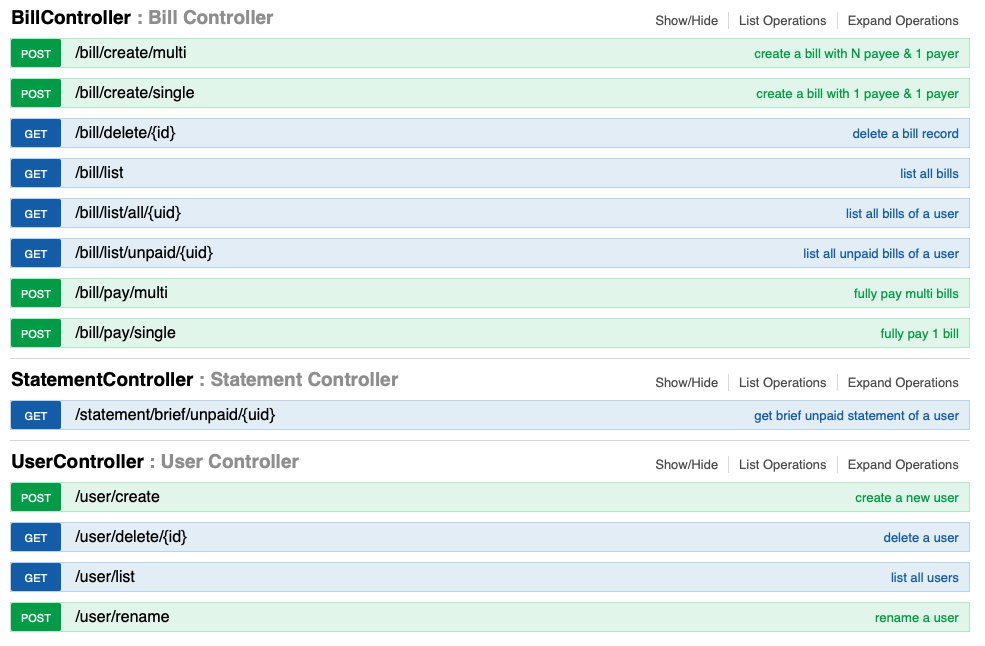

# Let's Split
Bill Splitting System to handle daily bill-splitting task.

A user can:
- Create and modify the user's info
- Record, modify and list _one-payer-one-payee_ & _one-payer-N-payee_ bills
- Pay single or multiple bills
- Retrieve the user's statement

## Usage
### Setup
To prepare for the data storage, 
use the [starter snippet](document/sql/letssplit.sql) in MySQL database `letssplit`.

This project is developed and maintained using Maven.

```shell script
mvn clean compile
```

### API
A good practice to know about API info is by using Swagger UI. 
Just access [local home page](http://localhost:8080/swagger-ui.html) of this project, then you get following options:

- Bill Controller
    - list bills
    - create bill(s)
    - pay bill(s)
    - delete bill
- User Controller
    - list users
    - create a user
    - rename a user
    - delete a user
- Statement Controller
    - generate user's statement

#### a screenshot of Swagger UI

